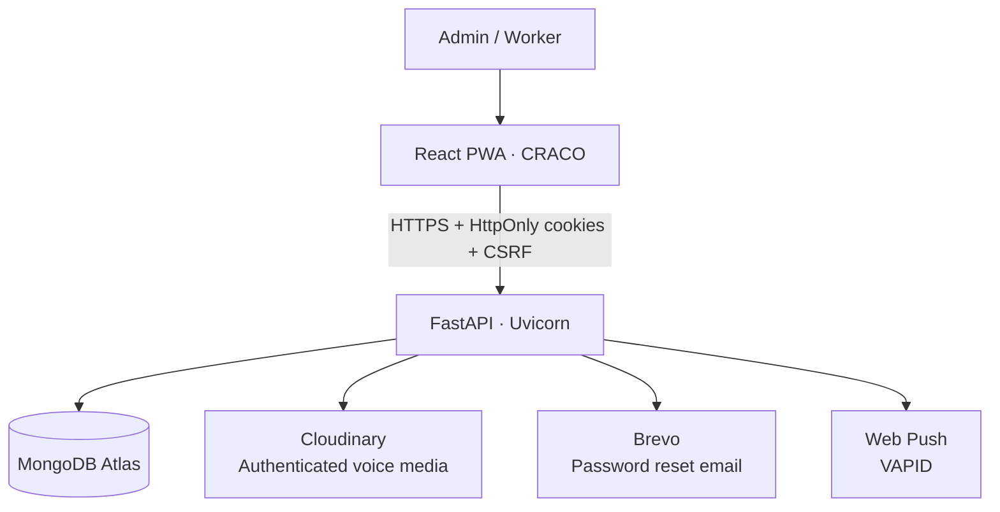

<div align="center">
  
  

  ### Attendance · Payroll · Payments · Worker Portal · Chat · PWA

  [](https://workforce-app-5oms.onrender.com)
  [](https://github.com/Nishant20361/workforce)

  
  
  
  
  
</div>

## About

WorkForce is a multi-business workforce management application for construction and field teams. It gives owners a secure workspace for worker records, attendance, payroll, payments, and private chat; workers receive a focused portal with their own attendance, money information, and conversations.

<p align="center"><a href="https://workforce-app-5oms.onrender.com"><b>Open the live application →</b></a></p>

## App preview

No repository screenshots are currently checked in. The layout below is intentionally ready for real captures—add only screenshots taken from a running WorkForce deployment.

| Admin workspace | Worker portal |
| --- | --- |
| `docs/screenshots/admin-dashboard.png` *(add a real capture)* | `docs/screenshots/worker-dashboard.png` *(add a real capture)* |
| Attendance & payroll | Mobile login & chat |
| `docs/screenshots/attendance-payroll.png` *(add a real capture)* | `docs/screenshots/mobile-login-chat.png` *(add a real capture)* |

## Highlights

| Owner / admin | Worker | Mobile experience |
| --- | --- | --- |
| Signup and username/email sign-in | Worker ID **or phone number** sign-in | Installable standalone PWA |
| Worker credentials, portal access and Active/Inactive controls | Secure persistent cookie session | Web Push notifications where supported |
| Attendance, payroll, payments, advances and extra work | Attendance and payment visibility | Voice notes and Hindi/English speech typing |
| Private worker chat, unread counts and app badges | Chat with owner, unread counts and audio playback | Responsive React interface |

### Messaging and communication

- Owner ↔ Worker tenant-isolated chat with text and Cloudinary-backed voice notes.
- `read_at`-backed unread counts and supported-browser app badges.
- Standard Web Push subscriptions using VAPID; a failed notification never blocks a message.
- Hindi (`hi-IN`) and Indian English (`en-IN`) speech typing fills the composer without auto-sending.

### Attendance, payroll and money

- Business-timezone attendance with present, absent and half-day records.
- Payroll summaries, payments, advances, adjustments and extra-work payments.
- Multi-business data isolation for every worker, transaction and conversation.

## Architecture



## Technology stack

| Layer | Technology |
| --- | --- |
| Frontend | React 18, JavaScript, CRA/CRACO, Tailwind UI utilities, PWA |
| Backend | Python, FastAPI, Uvicorn |
| Database | MongoDB Atlas via Motor |
| Media | Cloudinary authenticated voice assets |
| Email | Brevo transactional email |
| Hosting | Render |

## Project structure

```text
backend/                 FastAPI API, services and tests
  services/              Payroll, storage, email and push integrations
frontend/                React PWA
  public/                Manifest, service worker and WorkForce icons
  src/pages/             Admin, worker and authentication screens
  src/components/        Shared UI, chat and app components
```

## Local installation

```bash
git clone https://github.com/Nishant20361/workforce.git
cd workforce

# Configure without committing secrets
cp backend/.env.example backend/.env
cp frontend/.env.example frontend/.env

cd frontend
npm install
npm start
```

`npm start` starts the local backend when it is not already healthy, waits for `/api/health`, then starts React.

## Environment variables

Backend essentials:

```text
ENVIRONMENT MONGO_URL DB_NAME JWT_SECRET CORS_ORIGINS FRONTEND_URL
COOKIE_SECURE COOKIE_SAMESITE SESSION_MAX_AGE_SECONDS
MEDIA_STORAGE CLOUDINARY_CLOUD_NAME CLOUDINARY_API_KEY CLOUDINARY_API_SECRET
BREVO_API_KEY BREVO_SENDER_EMAIL BREVO_SENDER_NAME
VAPID_PUBLIC_KEY VAPID_PRIVATE_KEY VAPID_SUBJECT
```

Frontend essentials:

```text
REACT_APP_BACKEND_URL REACT_APP_VAPID_PUBLIC_KEY
```

Never commit `.env` files or put Cloudinary, Brevo, VAPID private, database, or JWT secrets in the frontend.

## Development commands

```bash
# backend checks
backend/venv/bin/python -m py_compile backend/server.py backend/main.py
backend/venv/bin/python -m pytest -q

# frontend checks and production bundle
cd frontend
CI=true npm test -- --watchAll=false
npm run build
```

## Production deployment

Deploy the FastAPI service and the built frontend on HTTPS-enabled Render services. Set explicit production CORS origins, secure cookies, Cloudinary credentials, Brevo values, and matching VAPID keys in Render environment settings. `REACT_APP_*` variables are build-time variables, so redeploy the frontend after changing them.

## Security

- HttpOnly, secure production cookies with CSRF request validation.
- Tenant identity is derived from the authenticated session—not from frontend-selected business IDs.
- Worker Active/Inactive, portal disablement, and credential changes revoke worker access.
- Voice assets are authorized by API checks before delivery.
- Passwords are hashed; remembered worker sign-in stores only a non-secret identifier.

## Roadmap

- Add real product screenshots to `docs/screenshots/`.
- Optional reports/export workflows and operational audit views.
- Expanded browser/device verification for installed-PWA push behavior.

## Developer

<div align="center">

**Nishant** · Building practical workforce tools

[](https://github.com/Nishant20361)
[](https://workforce-app-5oms.onrender.com)
[](YOUR_LINKEDIN_URL)
[](YOUR_INSTAGRAM_URL)

</div>

## License / use

This repository is a project portfolio and application codebase. Confirm the intended license and commercial-use policy with the maintainer before reuse.
